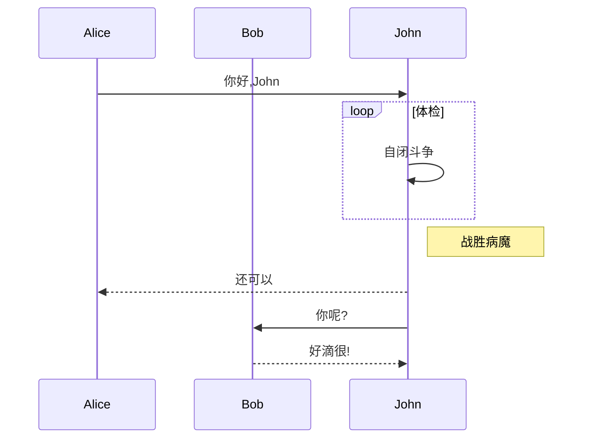
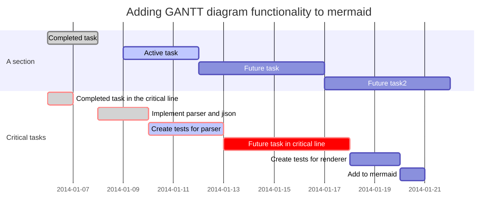

# 有趣的技术方向
- openstack云计算
- rtsp/rtmp/hls直播服务 网络授课
- 3d打印 2d/视频转3d建模, 及3d模型打印
- electron & c++ 跨平台开发(WeFlow/react-native/Weex)，跨平台网络框架(mars)
- microservice 框架(kong)，分布式云部署
- TSDB 时序数据库(influxDB)
- cocos2dx & lua/c++ 跨平台游戏开发
- 内网穿透/反向代理(frp/ssh) (路由器配置服务器为 LAN/DMT/端口转发/端口映射)
- p2p/bt/webtorrent/webrtc穿网，对等网络支持实时媒体播放
- IPFS星际文件系统(bt+git)， filecoin激励挖矿，自动扩张性，blockchain最佳载体
- vue [ant.design(element/iview), google UI] 组件化mvvm前端设计, storybook对象可视化, admin后台cms

  
# 配置使用
## 安装使用electron-vue
  - 将chrome扩展vue-devtools 拷贝到 %USERPROFILE%\AppData\Roaming\Electron\extensions
## ffmpeg-streaming
 - ```ffmpeg -re -i /e/download/BT/钢之炼金术师.mp4 -vcodec libx264 -acodec aac -f flv rtmp://localhost/live/stream```

# 序列图和甘特图

