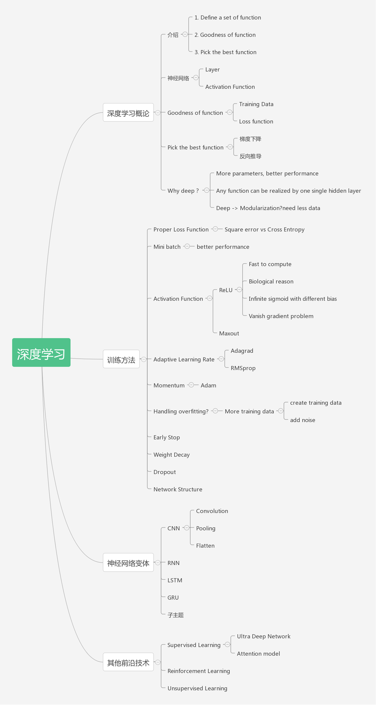

# 文档和线路
## 数学
- [线性代数视频课程](http://open.163.com/special/opencourse/daishu.html)
- [线性代数笔记](https://github.com/zlotus/notes-linear-algebra)
- 李航：统计学习方法
- 集体智慧编程
## 机器学习
- [学习顺序](https://morvanzhou.github.io/learning-steps/)
- [google视频速成](https://developers.google.cn/machine-learning/crash-course/ml-intro?hl=zh-cn)
- [新手入门](https://www.tensorflow.org/get_started/get_started_for_beginners)
## 深度学习
- [人工智能](https://www.zhihu.com/question/51039416)
- [入门](https://www.zhihu.com/question/26006703)
- [1天搞懂深度学习视频](https://www.jianshu.com/p/e6e29e1a8ae4)
- [1天搞懂深度学习](https://blog.csdn.net/u010164190/article/details/72633245/)
- [吴恩达视频](https://www.coursera.org/learn/machine-learning)
## 导图

## 监督式
> - 如何组合输入信息
> - 对从未见过的数据
> - 作出有用的预测

- 标签： 要预测的真实事物 y
- 特征：描述数据的输入变量 xi
- 样本：数据的特征实例 x
- 有标签的样本 (x, y)
    - 用于训练模型
- 无标签样本 (x, ?)
    - 用于对新数据做出预测
- 模型：将样本映射到预测标签: y'
    - 由模型的内部参数定义，这些内部参数值通过学习得到

## 非监督式  